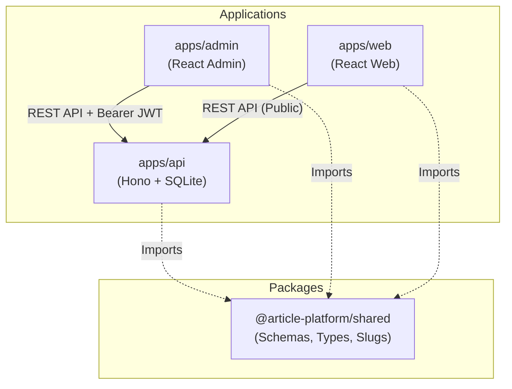

# Article Management Platform (Monorepo)

A high-performance, full-stack article management platform developed as a senior-level technical submission. The project is designed with a modern monorepo structure utilizing Bun Workspaces, Hono, React 19, SQLite, Drizzle ORM, Zod, and Tailwind CSS v4.

**GitHub Repository:** [https://github.com/M-r-Daniel/Article-Management-Platform](https://github.com/M-r-Daniel/Article-Management-Platform)

---

## 🏗️ Architecture & Monorepo Overview

This repository uses **Bun Workspaces** for fast installation, sharing code seamlessly between the backend API and frontend apps, and enforcing unified linting/formatting rules with Biome.

```
article-platform/ (Root)
├── packages/
│   └── shared/          # Shared types, Zod schemas, & slug generator (supports Arabic/Unicode)
├── apps/
│   ├── api/             # REST API built with Hono, SQLite, & Drizzle ORM (Port 3000)
│   ├── admin/           # Admin Dashboard built with React 19 & Tailwind v4 (Port 5173)
│   └── web/             # Reader Website built with React 19 & Tailwind v4 (Port 5174)
├── tsconfig.base.json   # Global strict TypeScript configuration
├── biome.json           # Formatting & linting configurations
├── Dockerfile           # Multi-stage production container setup
└── docker-compose.yml   # Multi-service container Orchestrator
```

### Dependency Flow



---

## ⚡ Tech Stack & Highlights

- **Bun Runtime:** High-performance engine, natively running TS files, Bun workspaces, and `bun:sqlite` for cross-platform SQLite database performance without native Windows C++ compilation issues.
- **Strict TypeScript:** Global strict mode enabled (`strict: true`, `noUncheckedIndexedAccess: true`). Zero `any` types or dynamic casting.
- **Unified Code Quality:** Enforced formatting and linting via Biome (replaces ESLint/Prettier with 10x performance).
- **Zod Data Verification:** Shared schemas validate data both at the client forms and the API routes (ensures data contract parity).
- **Arabic / Unicode Slugs:** The slug generator utility includes full Unicode support (converting Arabic titles to URL-safe strings like `أخبار-البرمجة` -> `أخبار-البرمجة`).
- **Tailwind CSS v4:** Incorporates Tailwind's new CSS-first config structure with premium UI features (glassmorphism, micro-animations, customizable dark mode variables).

---

## 🚦 Port Configurations

| App | Description | URL | Port |
|---|---|---|---|
| **API Backend** | Hono REST API, CORS-enabled, handles JWT & CRUD | `http://localhost:3000` | `3000` |
| **Admin Portal** | Admin panel (CRUD, publish state control) | `http://localhost:5173` | `5173` |
| **Web Reader** | Public articles website (reader mode, read-time estimate) | `http://localhost:5174` | `5174` |

---

## 🚀 Getting Started

### Prerequisites

Ensure you have [Bun](https://bun.sh/) installed:
```bash
bun --version
```

### 1. Installation

From the project root directory, install all workspace dependencies:
```bash
bun install
```

### 2. Database Migration & Seeding

Initialize the SQLite database and seed it with 10 rich test articles (including a mix of Draft and Published articles in both English and Arabic):
```bash
# Generate tables and indexes in sqlite.db
bun run --filter @article-platform/api db:migrate

# Seed database with sample articles
bun run db:seed
```

### 3. Local Development

Start all three applications (API, Admin, and Web) concurrently in development mode:
```bash
bun run dev
```
- API: `http://localhost:3000`
- Admin: `http://localhost:5173`
- Web: `http://localhost:5174`

---

## 🧪 Testing, Formatting, and Linting

We have a fully comprehensive test suite covering:
- **Shared Package:** Slug generation correctness, Zod schemas validation
- **Backend API:** Services validation, JWT auth middleware, public/admin routes endpoints integration

### Run Tests
Tests run concurrently inside `sqlite_test.db` using the fast, native Bun test runner:
```bash
bun run test
```

### Strict Code Verification
Verify TypeScript compilation and biome code quality:
```bash
# Run type checking across the whole workspace
bun run typecheck

# Check linting, formatting and imports ordering via Biome
npx biome check .
```

---

## 🐳 Running with Docker

Run the entire stack containerized using Docker Compose. The setup includes custom healthchecks using Bun native fetch to assure container initialization order and database persistence.

### Start with Docker Compose
```bash
docker-compose up --build
```
- **Web Reader:** `http://localhost:5174`
- **Admin Dashboard:** `http://localhost:5173`
- **API Server:** `http://localhost:3000`

---

## 🔐 Credentials & Authentication

To log into the Admin Dashboard (`http://localhost:5173`), use the following hardcoded security credentials:
- **Username:** `admin`
- **Password:** `admin123`

The authentication service uses the JSON Web Token (JWT) protocol signed via the lightweight `jose` library (validity: 24h).

---

## 📁 API Endpoints

All responses are enclosed in a consistent `ApiResponse<T>` envelope format:
```json
{
  "success": true,
  "data": { ... },
  "error": "Error message if success is false"
}
```

### Public Endpoints (No Auth Required)
- `GET /api/articles/public` - Returns all published articles (sorted by newest `createdAt` date)
- `GET /api/articles/public/:slug` - Returns article details matching the specified unique slug

### Admin Endpoints (Requires `Authorization: Bearer <JWT_TOKEN>`)
- `POST /api/admin/auth/login` - Authenticate admin credentials and retrieve a JWT token
- `GET /api/admin/articles` - Returns all articles (both drafts and published ones)
- `GET /api/admin/articles/:id` - Retrieve specific article details by ID
- `POST /api/admin/articles` - Create a new article (defaults to "draft" status)
- `PUT /api/admin/articles/:id` - Edit article content, title, and summary (regenerates slug on title changes)
- `DELETE /api/admin/articles/:id` - Delete an article from the database
- `PATCH /api/admin/articles/:id/publish` - Set article status to "published"
- `PATCH /api/admin/articles/:id/unpublish` - Set article status back to "draft"

---

## 🎨 Design Tokens & UI Features

The Admin Dashboard and Web Reader utilize a custom-curated, harmonic styling system built on **Tailwind CSS v4**:
- **Palette:** Dynamic grays mixed with deep indigos (`primary`), emeralds (`success`/`published`), and ambers (`warning`/`draft`).
- **Glassmorphism:** Elegant header bars and cards using translucent backdrops (`backdrop-blur-md bg-white/70`).
- **RTL & Arabic Friendly:** Seamless layouts formatting Arabic and English text dynamically with correct directionality.
- **Reading Progress Bar:** The Web article detail page includes a dynamic reading progress indicator tracking scroll percentage.
- **Toasts:** Sonner notifications alert users in real-time about API status (e.g. "Article successfully published").

---

## 🧠 Technical Decisions

| Decision | Rationale |
|:---|:---|
| **SQLite + Drizzle ORM** | Zero-configuration, fully type-safe ORM with native `bun:sqlite` bindings. Avoids cross-platform C++ compilation issues on Windows. Easily upgradable to PostgreSQL in production by swapping the driver — Drizzle schema remains identical. |
| **Hono over Express** | Ultra-fast framework purpose-built for Bun/Edge runtimes. Native TypeScript support, Web Standards API compatible, and zero external dependencies. The ARCT reference recommends Hono for Edge/Serverless targets. |
| **Zod Shared Schemas** | Single source of truth for data validation. The same schemas validate both client-side form inputs and server-side API payloads, eliminating contract drift between frontend and backend. |
| **JWT with `jose` library** | Lightweight, Web Crypto API compatible, zero native dependencies. Unlike `jsonwebtoken`, `jose` works seamlessly in Bun and edge environments without platform-specific binaries. |
| **Biome over ESLint + Prettier** | 10x faster performance as a unified linter and formatter in a single tool. Eliminates configuration conflicts between ESLint and Prettier and simplifies the developer toolchain. |
| **React Query (TanStack Query)** | Provides automatic server state caching, background refetching, and cache invalidation. Eliminates manual loading/error state management and ensures data freshness across components. |
| **Bun Workspaces** | Native monorepo support with instant dependency resolution and workspace linking. Faster than npm/yarn workspaces with built-in TypeScript execution — no build step needed for the shared package. |
| **Tailwind CSS v4** | CSS-first configuration with native cascade layers and zero JavaScript config files. Provides a premium design system with minimal bundle overhead. |

---

## 🔮 Future Improvements

Given more time, I would implement the following enhancements:

- **Rich Text Editor:** Integrate TipTap or MDX for WYSIWYG article composition with formatting controls, embedded media, and live preview.
- **Image & Media Upload:** Add an Object Storage integration (e.g., Cloudflare R2 or AWS S3) for article cover images and inline media assets.
- **Pagination & Sorting:** Implement cursor-based pagination for the articles API and sortable columns in the admin dashboard table.
- **Redis Caching Layer:** Cache frequently accessed public articles to reduce database load and improve response times for readers.
- **Rate Limiting:** Add token-bucket rate limiting middleware on public API endpoints to prevent abuse and ensure fair usage.
- **Full-Text Search:** Integrate SQLite FTS5 or a dedicated search engine for advanced article search capabilities.
- **E2E Testing:** Add Playwright end-to-end tests covering full user flows (login → create → publish → view on public site).
- **CI/CD Pipeline:** Configure GitHub Actions for automated linting, type checking, testing, and Docker image building on every push.
- **Role-Based Access Control:** Expand the simple admin role into a full RBAC system with Editor, Author, and Viewer roles.
- **Audit Logging:** Track all admin actions (create, edit, delete, publish) with timestamps and user context for compliance.
